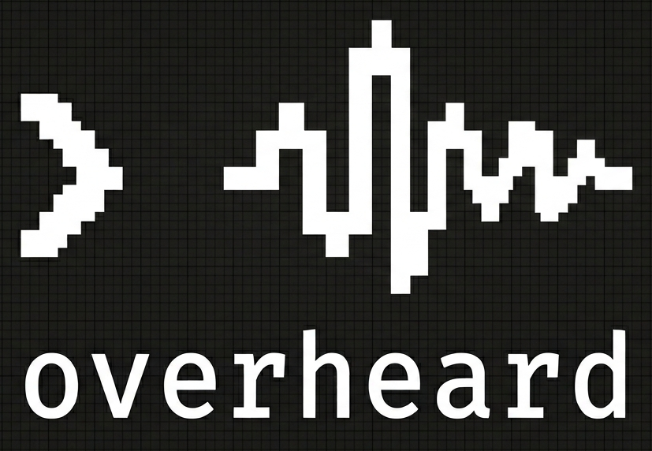
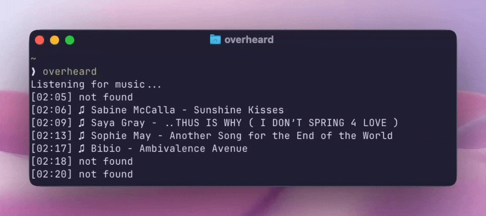

<p align="center">
  
</p>

# overheard

<p align="center">
  
</p>

*passive scrobbler for macOS*

**Auto-scrobble whatever's playing on your Mac.**

---

Listens to system audio via ScreenCaptureKit, fingerprints it with Shazam, and scrobbles to Last.fm. You can also send an immediate manual scrobble to the running instance with `overheard -a "Artist" -s "Song"`.

## How It Works

System audio is continuously captured and fed through two parallel paths: a spectral analyzer watching for track changes, and a ring buffer accumulating audio for recognition. When the analyzer detects a transition (or a periodic timer fires), the buffered audio is written to a temp WAV and identified via [shazamio](https://github.com/dotX12/shazamio).

```
ScreenCaptureKit (system audio)
    │
    │  PCM 44.1kHz mono
    ├──────────────────────────────┐
    ▼                              ▼
AudioAnalyzer                  MusicRecognizer
├ FFT spectral flux               ├ 5-10s ring buffer
├ MFCC cosine distance            ├ WAV → recognize.py
└ transition detection ──trigger──→└ shazamio fingerprint
                                       │
                                       ▼
                               ScrobbleController
                               ├ now playing → Last.fm
                               ├ 30s eligibility gate
                               └ scrobble + offline queue
```

## Prerequisites

- macOS 14+
- Swift 6.0+
- [uv](https://github.com/astral-sh/uv) (Python package runner)
- Screen Recording permission (for system audio capture)
- Last.fm account

## Getting Started

### Install uv

[uv](https://docs.astral.sh/uv/getting-started/installation/) is used to run the Python recognition script without managing a virtualenv.

```bash
curl -LsSf https://astral.sh/uv/install.sh | sh
```

### Install

```bash
git clone https://github.com/fabiogaliano/overheard.git
cd overheard
sudo make install
```

This builds a release binary and installs:

- `overheard` to `/usr/local/bin`
- `recognize.py` to `/usr/local/libexec/overheard`

If you prefer a user-local install without `sudo`:

```bash
make install PREFIX="$HOME/.local"
```

If you use `~/.local`, ensure `~/.local/bin` is on your `PATH`.

### Update

```bash
cd overheard
git pull
make install
```

### Uninstall

```bash
sudo make uninstall
```

### Run

```bash
overheard
```

If you haven't logged in yet, it will prompt for your Last.fm credentials first, then start scrobbling. To log in explicitly:

```bash
overheard login
```

To send an immediate manual scrobble to a running `overheard` instance:

```bash
overheard -a "Artist" -s "Song"
```

To love the last song recognized by the running `overheard` process:

```bash
overheard -l
```

### Listen-Only Mode

Start overheard without scrobbling — useful when the audio source already scrobbles and you just want to identify songs and love them:

```bash
overheard --no-scrobble
```

You can toggle scrobbling on and off at runtime:

```bash
overheard --toggle
```

### Debug Mode

```bash
overheard --debug
```

Surfaces the full pipeline state: audio buffer reception, spectral analysis metrics, recognition attempts, and scrobble decisions.

### Auto-Exit

By default, overheard exits after 5 minutes of silence. To adjust or disable:

```bash
overheard --auto-exit 10     # 10 minutes
overheard --auto-exit off    # never auto-exit
```

## Project Structure

```
Sources/
├── main.swift               # CLI entry point
├── Config.swift             # Session, lock file, paths
├── AudioCapture.swift       # ScreenCaptureKit stream
├── AudioAnalyzer.swift      # FFT + MFCC transition detection
├── MusicRecognizer.swift    # Audio → shazamio bridge
├── TrackSession.swift       # Play eligibility tracking
├── ScrobbleController.swift # Orchestrator + timers
├── ScrobbleQueue.swift      # Offline retry queue
└── LastFmClient.swift       # Last.fm API client

recognize.py                 # shazamio fingerprinting script
```

## Tech Stack

| Layer       | Technology       |
| ----------- | ---------------- |
| Language    | Swift 6          |
| Audio       | ScreenCaptureKit |
| DSP         | Accelerate/vDSP  |
| Recognition | shazamio (Python)|
| Runner      | uv               |
| API         | Last.fm          |

## How Recognition Triggers

| Trigger    | Interval | Purpose                          |
| ---------- | -------- | -------------------------------- |
| Transition | On event | Spectral flux + MFCC spike       |
| Periodic   | 50s      | Catch missed transitions         |
| Silence    | ~279s*   | Clean exit when nothing's playing|

\* Configurable via `--auto-exit <minutes>`, or disable with `--no-auto-exit`.

## License

MIT
